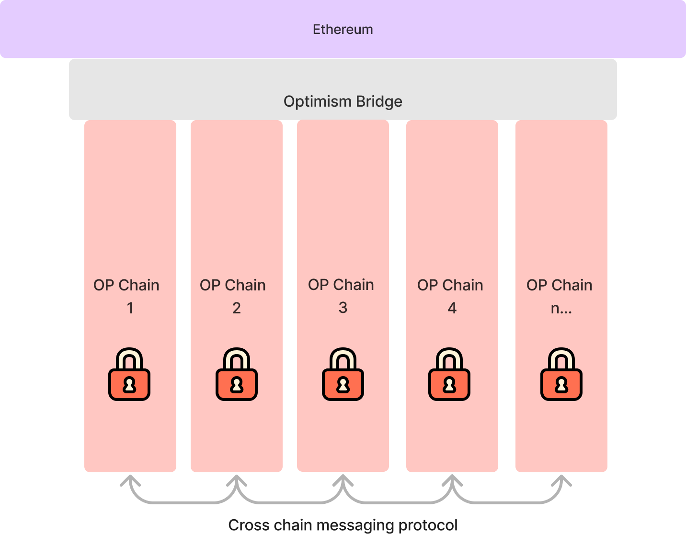

::: tip 保持更新

[通过订阅Optimism通讯了解Superchain和OP Stack的最新动态](https://optimism.us6.list-manage.com/subscribe/post?u=9727fa8bec4011400e57cafcb&id=ca91042234&f_id=002a19e3f0)。

:::

在[Bedrock](../releases/bedrock/)之后，OP Stack的下一个重大可扩展性改进是引入“Superchain”概念：一组共享桥接、去中心化治理、升级、通信层等功能的链网络，全部构建在OP Stack之上。

Superchain的推出将把Optimism Mainnet和其他链合并为一个统一的OP Chains网络，并标志着将可扩展和去中心化计算带给全球的重要一步。本文档的目标是描述可扩展性愿景、Superchain概念以及实现这一愿景所需的OP Stack的一些变化。

这是详细的解释。[点击此处查看简介](https://app.optimism.io/superchain/)。

::: tip 注意

目前，Superchain只是一个概念和正在进行中的项目，并非具体的现实。本文档代表我们对Superchain组件、功能和路线图的最佳估计。最终的实现将取决于（并随着）Optimism Collective的各方贡献。我们迫不及待地想看到它的发展。

:::

## 可扩展性愿景

### 当前的区块链技术无法满足去中心化网络的需求

不幸的是，区块链生态系统尚未实现创建去中心化网络的潜力，即通过无需信任的协议替代可信实体。这主要是因为大多数Web应用由于当前区块链技术的可扩展性限制而无法在链上运行，这个问题从区块链产业诞生以来一直困扰着该行业。

事实上，在对比特币白皮书的第一个回应中，就有人提出了具有非凡远见的问题：

> **我们非常非常需要这样一个系统，但根据我对您的提议的理解，它似乎无法扩展到所需的规模。**

十多年过去了，情况并没有改变。

### 可扩展的去中心化计算的价值巨大...

想象一下，如果我们解决了区块链可扩展性问题，如果在链上交易与与集中式后端交互一样便宜，那么在这个世界上，我们将能做到什么？

- 开发人员不需要担心应用所依赖的后端基础设施，因为链保证了正确执行、可用性和[水平扩展性](https://en.wikipedia.org/wiki/Scalability#Horizontal_(scale_out)_and_vertical_scaling_(scale_up))。
- 由于共享的智能合约执行环境，可组合性将远远超出传统REST API的能力。
- 通过标准化的燃料市场，开发人员不需要为用户的所有基础设施成本买单。对于应用开发者来说，支付一个病毒式应用程序不再是进入门槛，更多的盈利策略将被解锁。

这些特性的结合将使得在不触及传统后端软件栈的情况下，编写高度可扩展的Web应用成为可能。摆脱对后端的担忧是一个价值主张，不仅适用于去中心化爱好者，也适用于普通的应用程序开发人员，他们只想发布一个产品。通过可扩展性，区块链可以从一个小众兴趣变成每个开发人员工具包的核心组件。

此外，在这个大部分应用都上链的世界中，更多的数据将变得具有密码学可验证性。这种密码学可验证性使用户能够在所有应用程序之间建立可转移的声誉。然后，这个声誉可以用于投票、贷款和抵押，从而在互联网上促进信任。此外，用户不会失去访问权限，因为他们保留了对其数据、应用程序和声誉的所有权。

毫无疑问，区块链的承诺可能改变我们所知的互联网。

### ...去中心化网络仍然可以实现

这个假设并不是一个梦想，而是一个有形的未来愿景，激励着许多人，包括Optimism在内，致力于追求这个目标。由于这些集体贡献，每年我们都会对区块链技术栈有更多的了解，并且离实现这个愿景越来越近。

在行业的支持下，我们认为如何构建一个真正可扩展的区块链的清晰图景开始显现出来。我们称之为“Superchain”。本文档阐述了Superchain架构的核心技术原则，以及一系列具体的项目，我们相信一旦完成，将最终实现区块链可扩展性愿景。这将是一个多年（甚至十年）的旅程。然而，如果我们大致知道我们要去哪里，我们会走得更快一些。

## 基础Superchain概念

### 水平扩展性需要多个链...

水平区块链扩展性基本上需要多个链。这是因为同步链所需的硬件要求随着链的计算量的增加而线性增加。因此，为了实现水平扩展性，我们必须并行运行多个链。

::: details 链

一个状态[转换系统](https://en.wikipedia.org/wiki/Transition_system)，由初始状态、状态转换函数和输入列表（交易）组成，该系统通过密码学方式进行承诺，并可以使用普通计算机硬件和互联网连接进行独立复制。

:::

### ...但传统的多链架构不足以满足需求

传统的“多链”架构方法存在两个根本问题：

1. 每个链引入了一个新的安全模型，随着新链的引入，系统风险不断累积。（相关[链接](https://twitter.com/VitalikButerin/status/1479501366192132099?s=20)）
2. 新链的启动成本很高，因为它们需要新的验证者集和区块生产者。

这些问题源于缺乏一个共享的区块链（“L1”链），该链作为多链系统中所有链（“L2”链）的共享真实数据源。通过使用共享的真实数据源，可以实现以下目标：a）在所有链上强制执行标准的安全模型；b）消除链部署需要新的验证者集的要求，因为每个L2链使用L1共识。

### 不是多链，也不是单链...是Superchain

通过使用L2链来构建多链生态系统，可以开始将链视为可互换的计算资源。这种链的商品化使开发人员能够构建跨链应用程序，而无需引入系统性风险，并且在部署新链时不会产生大量开销。链本身的概念可以被抽象化，到这一点上，可以将这个互操作链网络视为一个单一单元：Superchain。

::: details Superchain

一个去中心化的区块链平台，由许多链组成，这些链共享安全性和技术堆栈（OP Stack）。互操作性和标准化使得工具和钱包可以将各个链视为相同的资源。

:::

## Superchain概述

### Superchain一览

Superchain是一组L2链（称为OP Chains）的网络，这些链共享安全性、通信层和开源技术堆栈。然而，与多链设计不同，这些链是标准化的，并且旨在作为可互换的资源使用。这使得开发人员可以将应用程序针对整个Superchain进行构建，并将底层链抽象化。

::: details OP Chain

Optimism Superchain中的单个链。所有链，无论其具体属性如何，只要它们受Optimism Collective的官方治理，就被视为OP Chains的一部分，因此属于Superchain。

:::

### Superchain的属性

为了使Optimism升级为Superchain，它必须具备以下属性：

| 属性 | 目的 |
| - | - |
| 共享的L1区块链 | 为所有OP Chains提供交易的总排序。
| 所有OP Chains的共享桥接 | 使OP Chains具有标准化的安全性能。
| 便宜的OP Chain部署 | 使得在OP Chains上部署和交易不需要高昂的L1交易费用。
| OP Chains的配置选项 | 使OP Chains能够配置其数据可用性提供者、序列器地址等。
| 安全的交易和跨链消息 | 使用户能够安全地在OP Chains之间迁移资产。

一旦Optimism满足了这些属性，它就可以被视为Superchain。

## 将Optimism升级为Superchain

我们认为以下更改（在Bedrock发布之后）是创建一个初始Superchain所需的，使得可以使用相同的桥接部署和升级多个链：

### 将Bedrock桥接升级为链工厂

Bedrock引入了[SystemConfig合约](https://github.com/ethereum-optimism/optimism/blob/74a63c94d881442b4edd4df6492513e0113eb064/packages/contracts-bedrock/contracts/L1/SystemConfig.sol)，该合约开始直接使用L1智能合约定义L2链。可以进一步扩展此合约，将完全定义L2链的所有信息都存储在链上。包括生成唯一的链ID、关键配置值（如区块燃料限制）等。

一旦链数据完全存储在链上，我们可以创建一个工厂，为每个链部署配置和所有其他所需的合约。通过使用CREATE2使合约地址确定性，这意味着在给定链配置的情况下，可以确定与该链相关的所有桥接地址。这还使得可以在不部署其桥接合约的情况下与链进行交互，使（反事实的）链部署几乎免费，并允许链继承标准的安全性能。

alone! The only way we can hope to achieve it is through open source contributions from folks like you! And with [retroactive public goods funding](https://medium.com/ethereum-optimism/retroactive-public-goods-funding-33c9b7d00f0c) your open source contributions may be rewarded too!

Exciting times ahead.

Stay Optimistic 🔴✨

## Glossary

- **Attestation-Based Fault Proof**: A fault proof where challenges can be successfully made by supplying an attestation proof which disagrees with the original withdrawal claim.

- **Attestation-Based Validity Proof**: A validity proof which can be verified by supplying an attestation proof which agrees with the withdrawal claim.

- **Attestation Proof**: A proof which consists of some number of signatures from a pre-agreed upon set of chain attestors.

- **Cannon Fault Proof**: A fault proof where challenges are evaluated using an onchain game which is guaranteed to result in a truthful outcome, given economic rationality assumptions.

- **Chain**: A state [transition system](https://en.wikipedia.org/wiki/Transition_system)—consisting of an initial state, a state transition function, and a list of inputs (transactions)—which is cryptographically committed to and can be independently replicated with commodity computer hardware and internet connection.

- **Chain Proof**: Difficult to forge evidence of the validity of a particular withdrawal claim. Proofs are commonly used to enable chains to communicate with each other.

- **Challenge Period**: The window of time in which a challenge can be made to disprove a fault proof.

- **Fault Proof**: A proof which relies on the absence of counter-evidence to prove correctness.

- **Modular Proof**: The ability to use multiple proof systems for the same OP Chain. For instance, it should be possible to prove an OP Chain using a fault proof or a validity proof.

- **Modular Sequencing**: The ability to configure the sequencer address during OP Chain deployment. This value can be configured by the OP Chain deployer.

- **OP Chain**: An individual chain within the Optimism Superchain. All chains, regardless of their specific properties are considered OP Chains if they are officially governed by the Optimism Collective, and therefore part of the Superchain.

- **Plasma Chain**: A chain where transaction data is committed to on L1 but not supplied to L1 directly, with a data availability challenge fallback.

- **Rollup Chain**: A chain where all transaction data is submitted to L1.

- **Sequencer**: The specific entity or smart contract which has priority when submitting transactions to an OP Chain.

- **Superchain**: A decentralized blockchain platform which consists of many chains that share security and a technology stack (OP Stack). The interoperability and standardization enable individual chains to be treated identically by tools and wallets.

- **Superchain Bridge**: The L1 bridge contracts which govern all OP Chains in the Superchain. This bridge can be upgraded by the Optimism Collective.

- **Validity Proof**: A proof of a withdrawal claim which can be immediately validated, without a challenge period.

- **Withdrawal Claim**: A claim about the state of one chain made on another chain. For instance, I can claim that in OP Mainnet I have burned my tokens with the intent to withdraw those tokens back to L1.

- **Zero Knowledge Proof**: A validity proof which relies on cryptographic properties and low error margins.
### Derive OP Chain data using the chain factory

[Bedrock introduced L2 chain derivation from an L1 chain](../releases/bedrock/explainer/#block-derivation), where all chain data can be synced based on L1 blocks. With the L1 chain factory extending this to put all configuration onchain, it should become possible for Optimism nodes to sync *any* OP Chain deterministically given a single L1 address plus a connection to L1.

::: tip 📌 

When the OP Chain is synced, the chain state is locally computed. This means determining the state of the OP Chain is fully permissionless & secure. No proof system is required for chain derivation because all invalid transactions are simply ignored by the local computation process performed by the node. A proof system is, however, still required to enable Superchain withdrawals.

:::

### Permissionless proof system to enable withdrawals

In Bedrock, there is a permissioned entity (the proposer) who is required for users to submit withdrawals. Additionally, proposers must submit proposals to L1 at a set interval. This introduces linear overhead as the number of chains in the Superchain increases, and even introduces an upper bound on the number of chains due to the limited L1 resources.

In order to address these issues, we can introduce two features:

1. Withdrawal claims (a.k.a. Permissionless proposals) — allow anyone to submit a withdrawal (aka a proposal), not just a designated proposer. This removes the permissioned entity from the system, enabling users to submit their own withdrawal messages.
2. Remove proposal submission interval — enable withdrawal claims to be made *only* when a user needs to withdraw. This removes the overhead incurred when deploying a new OP Chain.

::: details Withdrawal claims

A claim about the state of one chain made on another chain. For instance, I can claim that in OP Mainnet I have burned my tokens with the intent to withdraw those tokens back to L1.

:::

We can enable these two features first by introducing a permissionless proof system to the Optimism bridge contracts. With the modular proof design introduced in Bedrock, proofs may come in the form of fault proofs or validity proofs (e.g. zero knowledge proofs). However, until validity proofs are productionized, we assume withdrawals will use a fault proof system.

In the envisioned fault proof system, anyone can submit a withdrawal claim, and these withdrawal claims can be submitted at any time. Submitting withdrawal claims can be permissionless when claims come with bonds attached to them, as these bonds act as collateral if the claim is proven to be invalid. If a challenger successfully challenges the claim, the bond is paid out to the challenger for their participation in securing the system, thereby preventing spam even within this permissionless system. Additionally, there is no need to submit them at a regular interval because the fault proof game can efficiently prove the entire history of the chain since genesis.

The fault proof implementation may initially rely on a trusted set of chain attestors to be the final arbiter of disputes. Challengers must request attestations from a large number of chain attestors and combine these attestations into a single transaction called an attestation proof. The attestation proof is then used to challenge invalid claims.

The attestation-based fault proof should be designed to prefer safety over liveness. That means that if these chain attestors are malicious they cannot alone break the safety of withdrawals. The worst failure they can cause is preventing withdrawals from being processed until the next upgrade—a liveness failure.

In the future, the attestation proof will be incrementally phased out and replaced with trust-minimized proofs such as the [Cannon proof system](https://github.com/ethereum-optimism/cannon).

### Configurable sequencer per OP Chain

Bedrock introduced the ability to set the sequencer address in the SystemConfig contract. As we introduce multiple chains with their own SystemConfig contracts, we can enable the sequencer address to be configured by the OP Chain deployer. We call this configurable sequencer design modular sequencing. This enables OP Chains to be sequenced by different entities while retaining the standard [Superchain bridge] security model—a critical step towards sequencer decentralization.

::: details Modular sequencing

The ability to configure the sequencer address during OP Chain deployment. This value can be configured by the OP Chain deployer.

:::

::: details Superchain bridge

The L1 bridge contracts which govern all OP Chains in the Superchain. This bridge can be upgraded by the Optimism Collective.

:::

Within the Superchain bridge security model, chain safety (i.e. validity) as well as chain liveness (i.e. censorship resistance) is guaranteed. Safety is guaranteed by the proof system, and liveness is guaranteed by the ability to submit [transactions directly to L1](../releases/bedrock/explainer/#deposits). The combination of safety and liveness means that if an OP Chain sequencer were to misbehave, users can always submit transactions to L1 that migrates their usage to a new OP Chain with a correctly functioning sequencer.

Modular sequencing also enables permissionless experimentation with different sequencing models. Developers can envision implementing sequencing protocols such as: round robin sequencing, sequencer consensus protocols, PGA ordering, or FIFO ordering. We can expect that over time user friendly sequencing standards will emerge from the competition between competing sequencing protocols.

### One shared upgrade path for all OP Chains

To ship the initial Superchain with high confidence in security and decentralization, a decentralized security council should be introduced to govern upgrades. The security council should be able to update the set of chain attestors, initiate contract upgrades with a delay, and hit an emergency bridge pause button which also cancels pending upgrades.

The ability to pause the bridge in case of emergency means that in the worst case, where the requisite threshold of the security council participants had their private keys leaked, the result would be that withdrawals are indefinitely paused and bridge upgrades would be perpetually canceled. In other words, the L1 funds would be frozen. This follows the design principle of safety over liveness—the principle that one should always prevent the loss of funds (i.e. enforce safety) even if it means the funds get locked (i.e. sacrifice liveness).

#### Unfreezing the bridge via L1 soft fork

In order to address the frozen funds, there is a potential final recovery mechanism which has been discussed by the L2 community which we call the “L1 Soft Fork Upgrade Recovery” mechanism. This mechanism enables L1 to initiate a bridge upgrade with a soft fork, bypassing all other permissions within the Superchain bridge contracts. This approach may [introduce systemic risk](https://vitalik.ca/general/2023/05/21/dont_overload.html) to Ethereum and requires research and community buy-in before implementation. It is not required for implementing the Superchain and is being documented for research completeness. Without further research into the implications and safety, it is not an approach the team currently endorses.

The mechanism is as follows:

*Anyone* may propose an upgrade by submitting a transaction to a special bridge contract, along with a very large bond. This begins a two week challenge period. During this challenge period, anyone may submit a challenge which immediately cancels the upgrade and claims the bond. Under normal circumstances, it is impossible that an upgrade would go uncancelled for the required two weeks due to the large incentive provided for anyone to cancel the upgrade. However, if the upgrade is accompanied by a modification to Ethereum L1 validator software (the L1 soft fork), which ignores blocks that contain the cancellation transaction then it may succeed.

While a successful upgrade of this type would represent a soft fork of Ethereum L1, it would not incur long term technical debt to the Ethereum codebase because the soft fork logic can be removed once the upgrade has completed.

We expect this escape hatch will never be used, but its very existence could deter malicious behavior.

### The combination of these features results in a system satisfying the core Superchain properties

We believe these upgrades can provide a shared bridge for all OP Chains, cheap OP Chain deployment, important configuration options for the OP Chains, as well as secure transactions and cross-chain messages. Because the Bedrock release already provides the property of a shared L1 blockchain, after these changes we will have achieved all of the core properties required for the Superchain.

## Extending the Superchain—enhancements to realize the vision

We expect that, if successful, the post-Bedrock Superchain release will mark a major milestone in the scalability and decentralization of Optimism. However, there will still be significant pain points which must be addressed before the full scalable blockchain vision has been realized. Anticipated pain points include:

1. Withdrawal claims rely on a trusted set of chain attestors.
2. Cross-Chain transactions are slow because they require waiting a challenge period.
3. Cross-Chain transactions are asynchronous, breaking the ability to perform atomic cross-chain transactions (like flash loans).
4. Posting transactions to the Superchain is not-scalable because the transaction data must be submitted to L1 which has limited capacity.
5. 目前没有易于构建可利用多个OP链的可扩展dApp的框架。
6. 目前没有易于管理多个OP链上的资产和dApp的钱包。

如果解决了这些痛点中的每一个，就有可能构建出去中心化的替代方案，甚至可以替代最复杂的Web2应用程序。

以下是潜在的未来增强功能的概述，当它们结合在一起时，可以解决上述每一个痛点。

### 多重证明安全

#### 痛点：

1) 提款索赔依赖于一组可信的链证明者。

#### 提议的解决方案：

可以通过引入无需许可的证明（例如Cannon）来替代一组可信的链证明者，其中纠纷解决完全在链上进行。然而，完全在链上进行的证明的挑战在于，如果它们出现故障，就没有备用机制。为了确保它们永远不会失败，可以引入多重证明系统，通过冗余提供安全性。有关多重证明设计的更多信息，请点击[此处](https://medium.com/ethereum-optimism/our-pragmatic-path-to-decentralization-cb5805ca43c1)。

### 低延迟的L2到L2消息传递

#### 痛点：

2) 跨链交易很慢，因为它们需要等待挑战期。

#### 提议的解决方案：

故障证明会增加用户体验的负担，因为它们需要等待挑战期才能安全地完成。这意味着，根据挑战期的长度，用户需要等待很长时间，才能将他们的资产从一个OP链迁移到下一个OP链。

另一方面，有效性证明没有这个问题。有效性证明没有挑战期，因此可以立即从一个OP链提取到下一个OP链。如果用户需要频繁地在链之间迁移，甚至在正常的dApp执行过程中，这一点非常重要。然而，有效性证明通常使用零知识证明（ZKP）来实现，这是昂贵且容易出错的。要真正将ZKP生产化到足以成为主要的跨链通信协议，可能需要几年的时间。

然而，在ZKP被生产化的同时，可以使用OP Stack的模块化证明系统实现低延迟的L2到L2消息传递。使用模块化证明，可以在同一链上使用两个证明系统。这就打开了提供低延迟桥接的可能性，同时在提供高安全性高延迟桥接的同时进行安全性的权衡。

这种异构的桥接系统意味着开发人员可以使用多种桥接类型来构建他们的应用程序，例如：

1. 高安全性、高延迟的故障证明（标准高安全性桥接）
2. 低安全性、低延迟的故障证明（通过缩短挑战期来实现低延迟）
3. 低安全性、低延迟的有效性证明（使用可信的链证明者代替ZKP）
4. 高安全性、低延迟的有效性证明（一旦ZKP准备就绪）

混合多个证明系统使开发人员能够为低价值资产提供低延迟桥接，并为高价值资产提供高延迟。甚至可以通过使用高安全性高延迟故障证明回退来将即时桥接的低安全性资产转变为高安全性资产。这个构建块使开发人员能够进行有趣的安全性权衡，例如使用高阈值证明与高安全性高延迟故障证明回退。

### 同步跨链交易

#### 痛点：

3) 跨链交易是异步的，无法执行原子跨链交易（如闪电贷）。

#### 提议的解决方案：

传统的跨链消息传递是异步的，这意味着跨链交易*不是*原子的。例如，如果用户想要执行跨链套利交易——在链A上购买代币A，在链B上出售代币B——不能保证他们的交易完全执行。用户可能会在没有出售代币B的情况下购买代币A。

可以通过在OP链上使用共享排序协议来引入同步跨链消息传递，并通过在链A和链B上的排序器上共享排序协议来实现原子跨链交互。在我们的示例中，链A和链B上的排序器将分别接收套利交易，并就何时包含它们达成共识，然后将每个交易原子地包含在链接块中。只有在每个链上确实包含了交易时才需要支付费用，这意味着排序器承担了同步风险，而不是我们初始示例中的用户。这些共享排序协议可以在后Bedrock超级链的模块化排序层上无需许可地实现。

通过低延迟的L2到L2消息传递和共享排序的组合，可以执行复杂的交易，如跨链闪电贷。甚至可以进一步创建一个EVM抽象，其中个别智能合约（甚至个别存储槽）存在于不同的链上。

### 可用性层 - Plasma协议

#### 痛点：

4) 将交易提交到超级链不可扩展，因为交易数据必须提交到L1，而L1的容量有限。

#### 提议的解决方案：

目前，L1的数据可用性（DA）远远无法扩展到支持互联网级别的规模。然而，可以通过使用Plasma协议来扩展OP链可访问的数据可用性，从而增加数据可用性。

通用的Plasma协议能够比L1更好地扩展，因为只有对交易数据感兴趣的用户才会下载Plasma数据，而在L1上，每个以太坊节点都会下载L1上的所有交易数据。这意味着Plasma数据非常便宜。然而，Plasma的安全模型比L1差——Plasma链的数据可能暂时不可用，这意味着用户必须从链上提取。请注意，这个安全模型仍然保证了Plasma链的安全性，只是没有保证活跃性。

::: details Plasma链

一种将交易数据提交到L1但不直接提交到L1的链，具有数据可用性挑战的回退机制。

:::

**Plasma协议概述：**

- 数据可用性（DA）提供者从用户那里接收交易数据。
- DA提供者对交易数据进行哈希处理，并将哈希提交到Plasma合约。
- 一旦哈希提交成功，DA提供者向用户发送一个证明，证明他们的交易数据包含在哈希中。如果DA提供者行为不端，他们将不会向用户发送证明。
- 如果DA提供者没有向用户发送证明，用户可以提交DA挑战。这迫使DA提供者将交易数据提交到链上。如果DA提供者没有在链上提交证明，哈希将被删除。这确保用户始终可以（在挑战期之后）同步Plasma链。
  - 在L1拥堵的情况下，DA挑战期可以延长。
- 用户还可以提交一个L1交易，以从Plasma链中提取资产，以切换他们的DA提供者。
- Plasma链的结算使用与Rollup链几乎相同的故障证明系统，唯一的区别是从链中使用哈希派生的附加数据在Plasma合约中完成。

由于哈希能够将任意大小的数据减少为恒定大小的承诺，并且能够并行化交易数据哈希处理，使用Plasma DA可以实现几乎完美的数据承诺水平可扩展性。这意味着可以将大规模可扩展的应用程序（如游戏或社交媒体）放在Plasma链上。

### 多链dApp框架

#### 痛点：

5) 目前没有易于构建可利用多个OP链的可扩展dApp的框架。

6) 目前没有易于管理多个OP链上的资产和dApp的钱包。

#### 提议的解决方案（草图）：

这不是一个核心协议更改，而是可以构建在核心Superchain协议之上的工具。这里的建议旨在提供改进部署到Superchain的工具的经验。

以下是一些可以使在Superchain上开发更好的工具：

1. 内容可寻址的智能合约 - 这使得合约在所有链上具有相同的地址。开发人员可以编写智能合约，这些合约在所有OP链上都以相同的地址进行了事实上的部署。如果OP链上的用户想要使用尚未在其链上可用的智能合约，他们可以独立部署代码。
2. 跨链合约状态管理标准 - 创建智能合约状态如何从一条链迁移到下一条链的标准，使开发人员能够在许多链上分片其应用程序。此外，这种逻辑可以在钱包中使用，以显示用户状态，就好像它们都在同一条链上。例如，如果用户的代币分布在许多链上，钱包可以使用跨链状态管理逻辑，知道它应该将用户余额显示为所有链上的代币余额之和。
  
  ::: tip 📌 

  对于以太坊可扩展性爱好者：这些框架可以通过使用户状态从庞大的链迁移到新的链上来解决状态增长问题。旧的庞大链可以以低燃气限制维护，或者完全废弃。
    
  :::
  
3. 超级链RPC端点 - 创建一个单一的RPC端点，用户可以将其超级链交易发送到，而不管它们是针对哪个OP链的，以使用户避免不断切换网络。

通过强大的多链dApp框架，部署跨链dApp可能会变得与部署针对单个链的dApp一样简单。

## 参与其中

我们相信扩展区块链将彻底去中心化互联网，并使创建横向可扩展、安全和去中心化的Web应用程序变得容易。我们认为OP Stack的Superchain发布可能是实现这一愿景的重要一步。然而，在发布之后，仍需要大量的工作来实现可扩展性愿景。

然而，伴随着巨大的挑战也带来了巨大的机遇！需要完成OP Stack的初始发布以及随之而来的生态系统的工作将为希望做出贡献的开发人员提供令人兴奋的机会。将有大量的低悬果实的贡献可以解锁。我们无法摘取它
